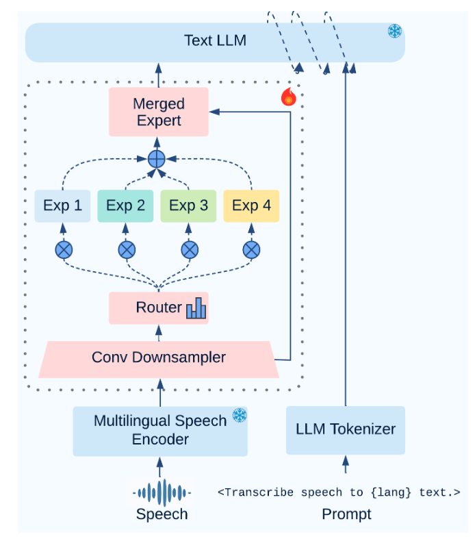

<div align="center">
    <h1>
    SMEAR-MoE-ASR
    </h1>
    <p>
    <b>SMEAR-MoE-ASR</b> builds on the <a href="https://github.com/X-LANCE/SLAM-LLM/tree/main">SLAM-LLM</a> codebase, extending it with stabilized Mixture-of-Experts projectors for robust multilingual ASR.
    <br>
    </p>
    <p>
    </p>
    <a href="https://github.com/ddlBoJack/SLAM-LLM"></a>
    <a href="https://github.com/ddlBoJack/SLAM-LLM"></a>
    <a href="https://github.com/ddlBoJack/SLAM-LLM"></a>
    <a href="https://github.com/ddlBoJack/SLAM-LLM"></a>
</div>


# Installation
```bash
git clone https://github.com/huggingface/transformers.git
cd transformers
git checkout tags/v4.35.2
pip install -e .
cd ..
git clone https://github.com/huggingface/peft.git
cd peft
git checkout tags/v0.6.0
pip install -e .
cd ..
pip install torch==2.0.1 torchvision==0.15.2 torchaudio==2.0.2 --index-url https://download.pytorch.org/whl/cu118
git clone https://github.com/ddlBoJack/SLAM-LLM.git
cd SLAM-LLM
pip install  -e .
```

For some examples, you may need to use `fairseq`, the command line is as follows:
```
# you need to install fairseq before SLAM-LLM
git clone https://github.com/pytorch/fairseq
cd fairseq
pip install --editable ./
```
We also provide a docker image for convenience:
```shell
# build docker image
docker build -t slam-llm:latest .

# run docker image with gpu
docker run -it --gpus all --name slam --shm-size=256g slam-llm:latest /bin/bash
```
# ASR-LLM

## Model Architecture

The proposed SMEAR-MoE-ASR architecture supports scalable multilingual training by adapting expert allocation to the number of languages and their shared acoustic-semantic structure.




## Data preparation
You need to prepare the data jsonl in this format.
```
{"key": "1001-134707-0000_ASR", "source": "/data/open_data/librispeech_audio/audio/librispeech_1001-134707-0000.wav", "target": "1 little recks the laborer. How near his work is holding him to God, The loving laborer through space and time, after all, not to create, only or found only."}
...
{"key": "1001-134707-0000_ASR", "source": "/data/open_data/librispeech_audio/audio/librispeech_1001-134707-0000.wav", "target": "1 little recks the laborer. How near his work is holding him to God, The loving laborer through space and time, after all, not to create, only or found only."}
```

## Decode

```
cd examples/asr_librispeech/scripts
bash decode_whisper_large_conv_gemma2_9b_new_benchmark_multi_lang_4_linear_moe_testing.sh
```
`num_lang` is used to set number of experts. Currently `num_expert == num_lang`
Modify the path including `speech_encoder_path`, `llm_path`, `output_dir`, `ckpt_path`, `val_data_path` and `decode_log` in the script when you run the shell script. 

## Train a new model

### Use whisper as the encoder
```
cd examples/asr_librispeech/scripts
bash finetune_whisper_large_conv_gemma2-9b_1e-3_multi_lang_4_linear_SmearMOE.sh
```
Whisper takes mel as input. Pay attention to the key `dataset_config.mel_size` for different version of the whisper model family. 

### Conformer encoder
**Ongoing Work**. Support for larger multilingual setups with scalable expert capacity is under development and will be released soon.


**Note**:
- if you are running on a machine with multiple GPUs please make sure to only make one of them visible using `export CUDA_VISIBLE_DEVICES=GPU:id`
- If you want to run with FSDP, you can set `++train_config.enable_fsdp=true` and `++train_config.enable_ddp=false`.

### Flash Attention and Xformer Memory Efficient Kernels

Setting `use_fast_kernels` will enable using of Flash Attention or Xformer memory-efficient kernels based on the hardware being used. This would speed up the fine-tuning job. This has been enabled in `optimum` library from HuggingFace as a one-liner API, please read more [here](https://pytorch.org/blog/out-of-the-box-acceleration/).


#  Citation
You can site us using: 
```
@article{pandey2026dynamic,
  title={Dynamic Multi-Expert Projectors with Stabilized Routing for Multilingual Speech Recognition},
  author={Pandey, Isha and Mittal, Ashish and Bahuguna, Vartul and Ramakrishnan, Ganesh},
  journal={arXiv preprint arXiv:2601.19451},
  year={2026}
}
```

## Configuration Priority
We provide hierarchical configuration inheritance relationships as follows:
```
command-line (shell file) > Hydra configuration (yaml file) > dataclass configuration (Python file)
```

# Features
- Easily extend to new models and tasks.
- Detailed recipes for training and high-performance checkpoints for inference.
- Mixed precision training which trains faster with less GPU memory on NVIDIA tensor cores. 
- Multi-GPU training with data and model parallel, supporting [DDP](https://pytorch.org/tutorials/intermediate/ddp_tutorial.html), [FSDP](https://pytorch.org/tutorials/intermediate/FSDP_tutorial.html) and [deepspeed](https://github.com/microsoft/DeepSpeed) (still need to be improved).  
- Flexible configuration based on [Hydra](https://github.com/facebookresearch/hydra) and [dataclass](https://docs.python.org/3/library/dataclasses.html) allowing a combination of code, command-line and file based configuration. 

# Acknowledge
- We borrow code from [Llama-Recipes](https://github.com/meta-llama/llama-recipes) for the training process. 
- We borrow code from [Fairseq](https://github.com/facebookresearch/fairseq) for deepspeed configuration. 
- We thank the contributors for providing diverse recipes. 
